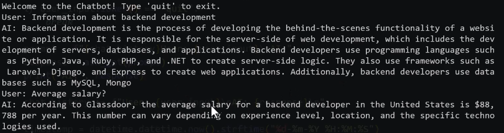

## Simple Script that simulates a conversational AI chatbot

Using OpenAPI, the chatbot answers your questions/prompts and save it into a txt file.

* You can define a role for the AI chatbot assistant by modifying the `ai_role` variable in the `main.py` file.
* Chatbot can relay on previous conversation prompts.

